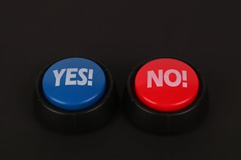

<!-- .slide: id="lesson3" -->

# JavaScript Course - Spring 2025

Lesson 3, Thursday, 2025-03-27

---

### Recap: Variables

A variable is a container for a value. We can use it to store a number or a string that is part of a sentence.
<!-- .element: class="fragment" -->

```js
// declare variable with name sum and number value 10
let sum = 10;
// declare variable with name sum and string value John Smith
let personName = 'John smith';
```
<!-- .element: class="fragment" -->

---

### Recap: Comparision operators

Comparison Operators compare values and return true or false
<!-- .element: class="fragment" -->

- `===` and `!==` → Strict equality and inequality
- `<` and `>` → Less than and greater than
- `<=` and `>=` → Less than or equal to, greater than or equal to

---

### Recap: Basic mathematical operators

Basic mathematical operators performs arithmetic operations:
<!-- .element: class="fragment" -->

- `+` addition
- `-` subtraction
- `*` multiplication
- `/` division
- `**` exponentiation

---

### Lesson overview

- Understanding Conditional Statements
- Using Comparison Operators to test conditions
- Logical operators
- Code blocks

---

<!-- .slide: id="if" -->

# Conditional statements

---

### What is a conditional statement?

What comes to mind when you look at these images?
<!-- .element width="400px" -->
<!-- .element width="400px" -->

A conditional statement __decides__ whether specific code runs based on whether a condition is true or false.
<!-- .element: class="fragment" -->

---

### if statements

`if` statement specifies code to be executed if a condition is true.

```js
if (condition) {
    // run code if condition is true
}
```

- The condition must be a boolean.
- The code in the block is executed only if the boolean is true.
- If the boolean is false, the code block is skipped.

---

### Testing conditions using Comparision operators

Comparison operators are used to test if a condition is true or false so we can decide when to run certain code.

```js
if (sum === 30) {
  document.body.textContent = 'sum is equal to 30';
}
```
<!-- .element: class="fragment" -->

---

### if Statements - Examples

```js
if (food === "pizza") {
  document.body.textContent = "My favorite food is pizza!";
}
```

```js
if (temperature > 20) {
  document.body.textContent = "Yay, it's warm again!";
}
```

```js
if (canSpeakFrench) {
  // same as: canSpeakFrench === true
  document.body.textContent = "Bonjour!";
}
```

---

### Code Blocks: {}

Code blocks contain the code between `{` and `}`, and should be indented for better readability:

```js
if (language === "German") {
  // In VSCode, you can indent code by pressing the "Tab" key,
  // or right-click and choose "Format Document"
  document.body.textContent = "Guten Tag";
}
```

---

### Code Blocks: {}

All variables defined in code blocks only exist inside the block (technical term: “block scope”)

```js
let name = "John Doe";
if (name === "John Doe") {
  let greeting = "Hi dude";
}
if (name === "Mary Doyle") {
  let greeting = "Hello my dear";
}
document.body.textContent = greeting; // ERROR!
```

---

### Code Blocks: {}

Correct solution:

```js
let name = "John Doe";
let greeting;
if (name === "John Doe") {
  greeting = "Hi dude";
}
if (name === "Mary Doyle") {
  greeting = "Hello my dear";
}
document.body.textContent = greeting; // "Hi dude"
```

---

## Logical operators: AND, OR and NOT

Logical operators are helpful if you want to test multiple conditions in an `if` statement.

- `&&` (AND) – All conditions must be true for the statement to execute.

<!-- .element: class="fragment" -->

- `||` (OR) – At least one condition must be true for the statement to execute.

<!-- .element: class="fragment" -->

- `!` (NOT) – Reverses the truth value of a condition (true becomes false and vice versa).

<!-- .element: class="fragment" -->

---

## Logical operators - Examples

`&&` (AND)
```js
let age = 25;
let hasLicense = true;
if (age >= 18 && hasLicense) {
    console.log("You can drive!");
}
```

`||`  (OR)
```js
let isRaining = false;
let hasUmbrella = true;
if (isRaining || hasUmbrella) {
    console.log("You're good to go outside!");
}
```

---

## Logical operators - Examples

`!`  (NOT)
```js
let isDaytime = false;
if (!isDaytime) {
    console.log("It's nighttime!");
}

```

---

### Quiz

What does the code below show on the HTML page?

```js
let food = "broccoli";
if (food === "pizza") {
  document.body.textContent = "yum yum";
}
```

Solution: Nothing, since the condition in the `if` is `false`

<!-- .element: class="fragment" -->

---

### Quiz

What does it output?

```js
let age = 42;
if (age >= 18) {
  document.body.textContent = "you are allowed to drive a car";
}
if (age < 18) {
  document.body.textContent = "you are not allowed to drive a car";
}
```

Solution: First condition is `true`, so it outputs "you are allowed to drive a car"

<!-- .element: class="fragment" -->

---

### Quiz

Which conditions are true or false?

```js
let age = 13;
if (age >= 18 && age <= 99) {
  document.body.textContent = "Welcome! You can register";
}

let colour = 'orange';
if (colour === 'orange' || colour === 'red') {
  document.body.textContent = "The colour is orange or red";
}
```

Solution: Second condition is `true`, , so it outputs "The colour is orange or red"

<!-- .element: class="fragment" -->

---

### Quiz

Is this code valid?

```js
if (canSpeakFrench) document.body.textContent = "Bonjour!";
```

Yes! `if` statements written without curly braces or code blocks are valid, however they are not recommend.
<!-- .element: class="fragment" -->

Code blocks help organize the code, making it easier to read and understand.
<!-- .element: class="fragment" -->

---

### Task

Write a code to check if the sum of two variables, `x` and `y`, is greater than or equal to 10.
<!-- .element: class="fragment" -->

Create a variable `x` with value of 4 and `y` with value of 5
<!-- .element: class="fragment" -->

Create a variable sum and assign a value of minus -1
<!-- .element: class="fragment" -->

If sum of `x and y >= 10`, update the variable sum with the result of `x + y`
<!-- .element: class="fragment" -->

Assign the value of sum to `document.body.textContent`.
<!-- .element: class="fragment" -->

---

### Bonus Challenge 🎯

- Try different values for `x` and `y` to test your code. What do you observe?
